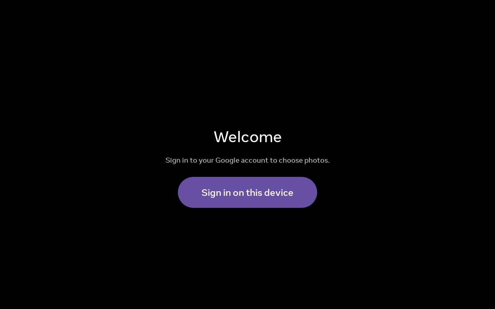
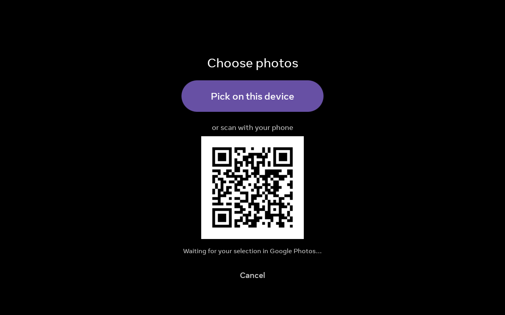
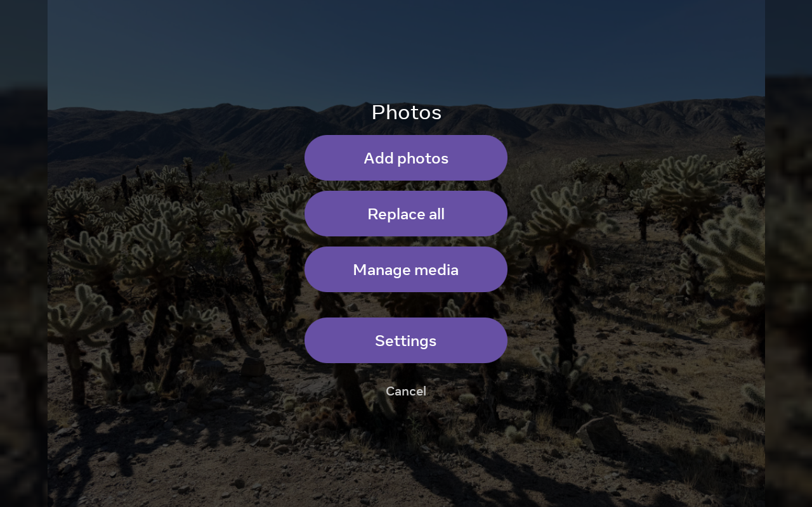

# Portal GPhotos

A native Android app that allows you to pick photos and videos from your Google Photos library and display them as a slideshow on your Facebook Portal.

[](https://andronedev.github.io/openportal/apps/com.ramnat.portalgphotos)

---

## 1. Prerequisites
- A Facebook Portal with Developer Mode (ADB) enabled.
- A computer with `adb` installed.
- [Download the latest release APK](https://github.com/ram-nat/portal-gphotos/releases/latest) and place it in the project directory, or clone this repo to build from source.

---

## 2. Google Cloud Platform Setup

Because this app connects to your personal Google Photos library, you need to create your own Google Cloud project and generate OAuth credentials.

1. **Create a project** at <https://console.cloud.google.com>.
2. **Enable the Photos Picker API**: APIs & Services → Library → search "Photos Picker
   API" → Enable. (Not the Library API, not the Ambient API.)
3. **OAuth consent screen**:
   - User type: **External**.
   - Add the scope `https://www.googleapis.com/auth/photospicker.mediaitems.readonly`.
   - Add your own Google account as a **Test user**.
4. **Create the OAuth client**: Credentials → Create credentials → OAuth client ID →
   Application type **Desktop app** → download the JSON (`client_secret.json`).

---

## 3. Deployment

Connect your Facebook Portal to your computer via USB (or over Wi-Fi ADB). Make sure to authorize the connection on the Portal screen.

Run the provided deployment script. This script automatically handles installing the APK, pushing your credentials, granting necessary system permissions, and setting up the screensaver hooks:

```bash
./scripts/deploy.sh --client client_secret.json
```

*(Note: If you have multiple devices connected, you can specify the target device with `-s <serial>`)*

**No computer with adb?** Once you have your `client_secret.json` from step 2, you can do this whole deployment from your browser with [OpenPortal](https://andronedev.github.io/openportal/apps/com.ramnat.portalgphotos), a Chromium-based web app that drives the Portal over USB with WebUSB + ADB. There's nothing to install on your machine, just plug in the Portal:

1. Click **Install** to download the release APK on the device and `pm install` it.
2. Open **Set up screensaver**, upload your `client_secret.json`, and apply. OpenPortal pushes the credentials, grants the settings permissions, registers the `PhotoDreamService` screensaver, and launches the app, the same configuration `deploy.sh` performs.

Then finish signing in on the Portal.

---

## 4. Usage
- Long press on screen to bring up the menu.
- Swipe left/right or tap on left/right edges to navigate between photos.
- Settings screen to control slideshow settings, weather, etc.
- Swipe down from top to get the top bar when screensaver is active

---

## 5. Bugs and Updates

- If you installed before 2026-06-13 (Builds v0.1.5 and before), there's a bug where when oauth refresh token expires, there is no way to refresh it from the device. To fix this, please use `deploy.sh` to re-deploy a later build. After this, you should be able to sign-in and grant access again from the device.

- Switch from Debug to Release APKs - if you are not building your own, this is a breaking change from release v0.1.3 - `deploy.sh` will handle retaining any downloaded media + client credentials automatically. However, you may lose your settings in the app and set them again.

---

## Screenshots




